# 🎯 BamStar Matching System Flow Charts

## 📊 System Overview

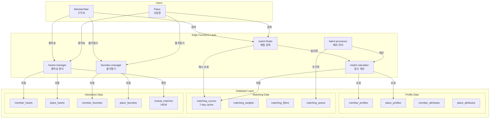

---

## 🔄 Matching Score Calculation Flow

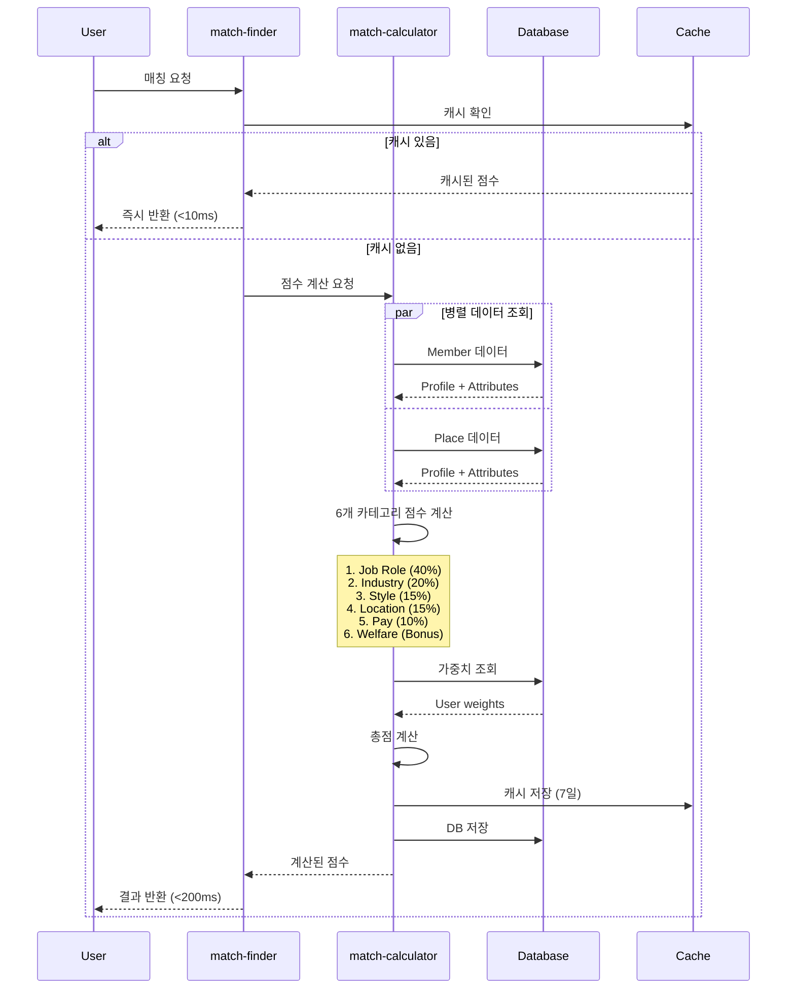

---

## 💝 Hearts (좋아요) Interaction Flow

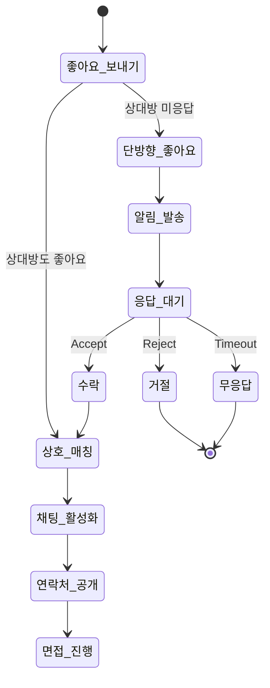

### Detailed Hearts Flow

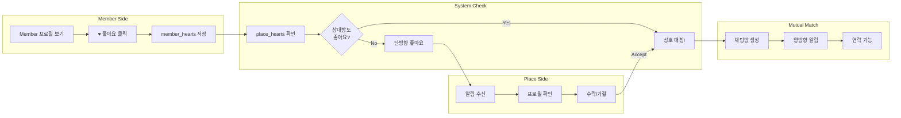

---

## ⭐ Favorites (즐겨찾기) Flow

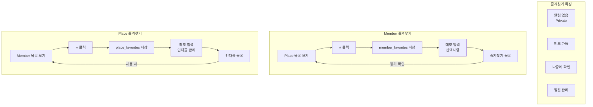

---

## 📍 Location-based Matching Logic

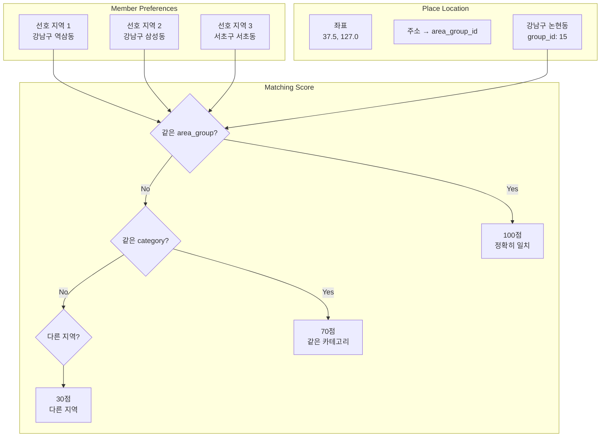

---

## 🔄 Batch Processing Flow

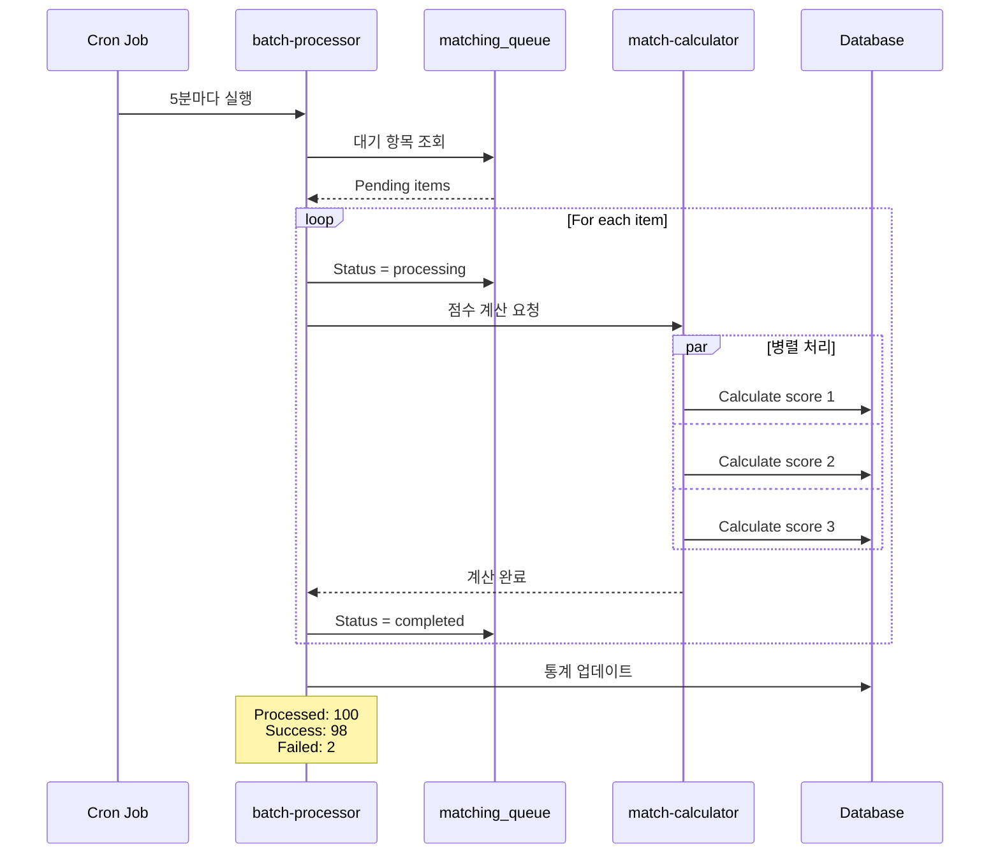

---

## 👤 User Journey - Member (Star)

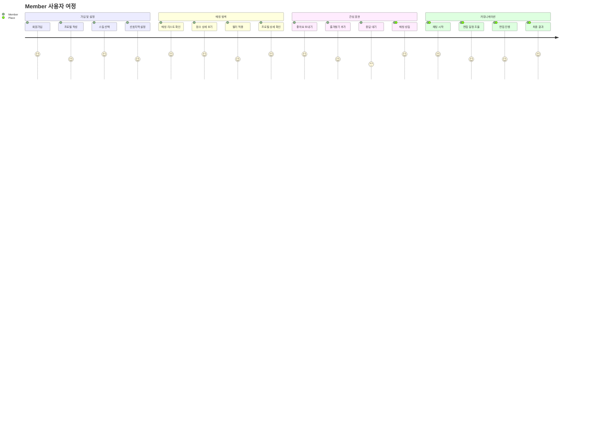

---

## 🏢 User Journey - Place

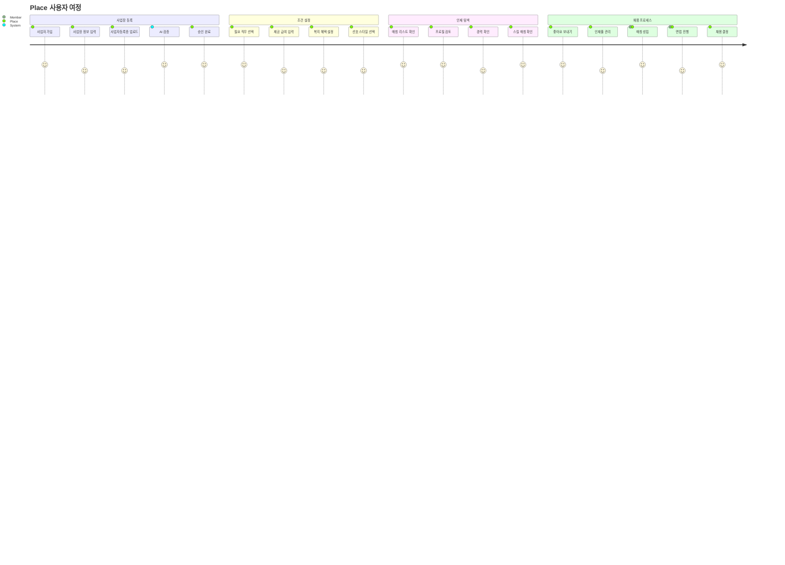

---

## 📊 Performance Metrics Dashboard

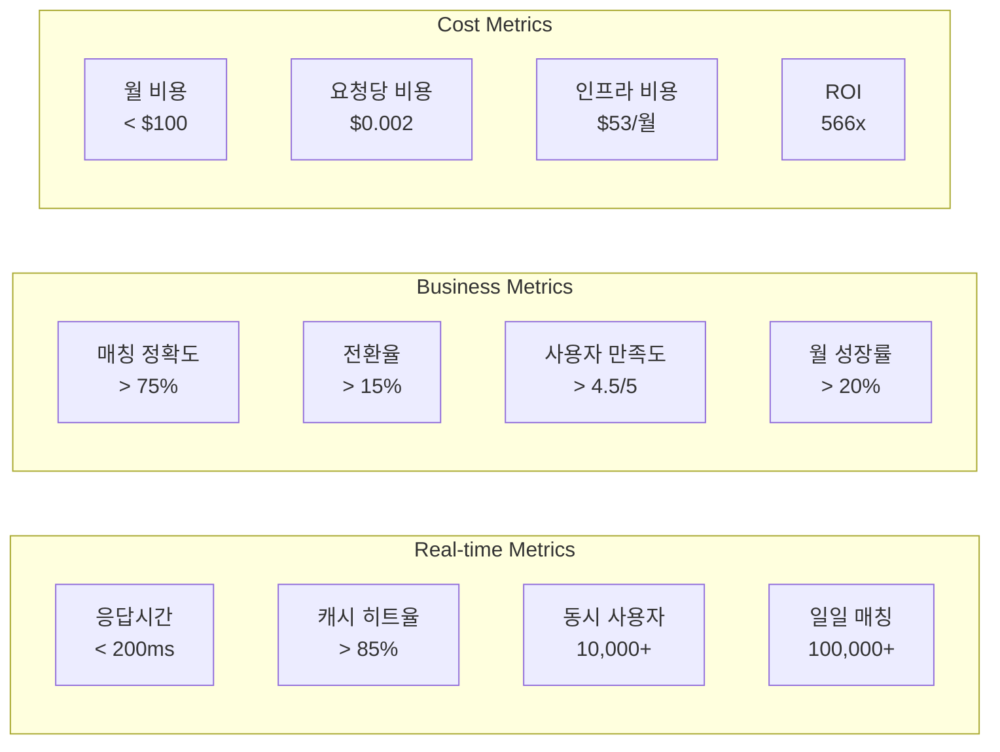

---

## 🚀 Migration Timeline

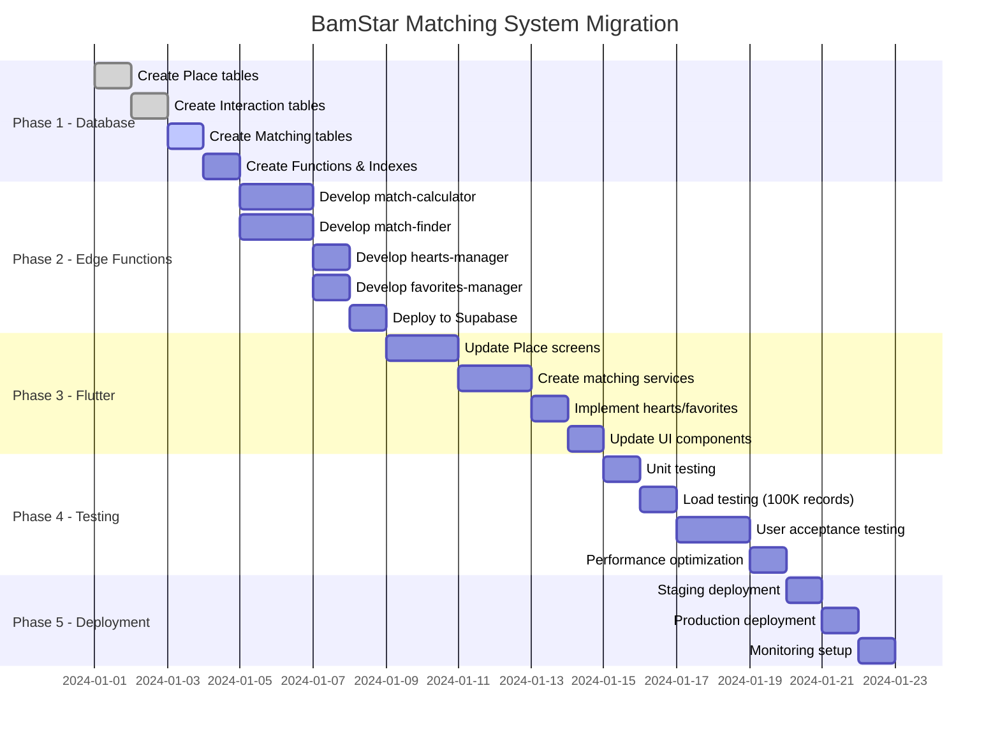

---

## 🎯 Success Criteria

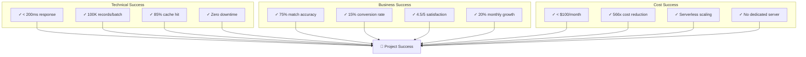