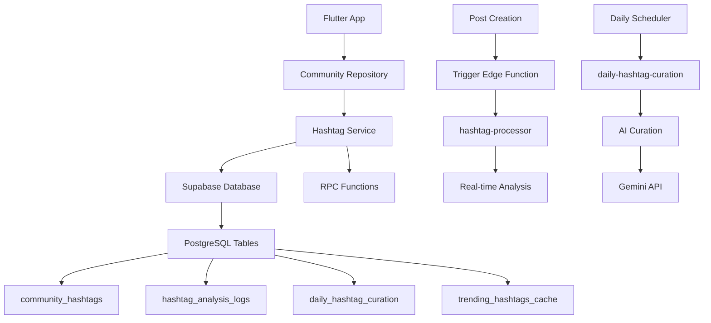

# 해시태그 자동화 시스템

BamStar 커뮤니티의 지능형 해시태그 자동화 시스템에 대한 완전한 가이드입니다.

## 📋 목차
- [시스템 개요](#시스템-개요)
- [아키텍처](#아키텍처)
- [주요 기능](#주요-기능)
- [설치 및 배포](#설치-및-배포)
- [사용 방법](#사용-방법)
- [API 레퍼런스](#api-레퍼런스)
- [성능 최적화](#성능-최적화)
- [트러블슈팅](#트러블슈팅)

## 🎯 시스템 개요

해시태그 자동화 시스템은 AI와 분석 기술을 활용하여 사용자의 콘텐츠에 최적화된 해시태그를 추천하고, 커뮤니티 트렌드를 실시간으로 분석하는 지능형 시스템입니다.

### 핵심 가치
- **🚀 사용자 경험 향상**: 콘텐츠에 맞는 해시태그를 자동으로 추천
- **📊 데이터 기반 인사이트**: 실시간 트렌드 분석 및 카테고리 분류
- **🤖 AI 기반 큐레이션**: 개인화된 추천 및 일일 큐레이션
- **⚡ 고성능 처리**: 병렬 처리 및 최적화된 데이터베이스 운영

## 🏗️ 아키텍처



### 주요 구성 요소

#### 1. Flutter 클라이언트
- **HashtagService**: 해시태그 추천 및 검색 서비스
- **CommunityRepository**: 데이터베이스 인터페이스
- **Smart UI**: 지능형 해시태그 입력 인터페이스

#### 2. Supabase 백엔드
- **RPC Functions**: 데이터베이스 비즈니스 로직
- **Edge Functions**: 서버리스 실시간 처리
- **PostgreSQL**: 확장 가능한 데이터 저장소

#### 3. AI 통합
- **Google Gemini**: 콘텐츠 분석 및 추천
- **자연어 처리**: 한국어 최적화 텍스트 분석

## ✨ 주요 기능

### 1. 실시간 해시태그 처리
```typescript
// 게시물 생성 시 자동으로 실행
POST /functions/v1/hashtag-processor
{
  "post_id": "12345",
  "content": "오늘 강남에서 맛있는 음식을 먹었어요!",
  "hashtags": ["강남맛집", "일상"],
  "user_id": "user123"
}
```

**처리 과정:**
1. 해시태그 통계 원자적 업데이트
2. 콘텐츠 기반 추가 해시태그 추천
3. 트렌드 분석 및 카테고리 분류
4. 분석 결과 로깅

### 2. 지능형 해시태그 추천

#### 콘텐츠 기반 추천
```sql
SELECT recommend_hashtags_for_content(
  '오늘 강남에서 맛있는 음식을 먹었어요! 정말 좋은 카페도 발견했답니다.',
  5
);
```

#### 개인화 추천
- 사용자의 과거 해시태그 패턴 분석
- 선호도 기반 맞춤형 추천
- 소셜 트렌드 반영

#### 실시간 트렌드 추천
- 최근 7일간 인기 상승 해시태그
- 카테고리별 트렌드 분석
- 시간대별 인기도 가중치

### 3. 스마트 검색
```sql
SELECT search_hashtags('맛집', 10);
-- 결과: exact, prefix, contains, fuzzy 매치 타입별 정렬
```

**매치 타입:**
- **Exact**: 정확한 일치 (`맛집`)
- **Prefix**: 접두어 일치 (`맛집추천`)
- **Contains**: 포함 일치 (`강남맛집`)
- **Fuzzy**: 유사도 기반 일치

### 4. 일일 큐레이션
```typescript
// 매일 오전 2시 자동 실행
POST /functions/v1/daily-hashtag-curation
```

**큐레이션 프로세스:**
1. 트렌드 분석 (최근 7일)
2. 미사용 해시태그 정리 (30일 이상)
3. AI 기반 새로운 해시태그 추천
4. 캐시 업데이트 및 결과 저장

## 🚀 설치 및 배포

### 1. 사전 요구사항
```bash
# Supabase CLI 설치
npm install -g supabase

# 환경 변수 설정
export SUPABASE_ACCESS_TOKEN="your_access_token"
export GEMINI_API_KEY="your_gemini_api_key"  # 선택사항
```

### 2. 배포 실행
```bash
# 자동 배포 스크립트 실행
./scripts/deploy_hashtag_system.sh
```

배포 과정:
1. ✅ 데이터베이스 마이그레이션
2. ✅ RPC 함수 생성
3. ✅ Edge Functions 배포
4. ✅ 환경 변수 설정

### 3. 시스템 테스트
```bash
# 배포 후 시스템 테스트
./scripts/test_hashtag_system.sh
```

테스트 항목:
- RPC 함수 동작 확인
- Edge Functions 실행 테스트
- 데이터베이스 테이블 접근
- 성능 부하 테스트

## 📱 사용 방법

### Flutter 앱 통합

#### 1. 기본 설정
```dart
import 'package:bamstar/services/community/hashtag_service.dart';

// 서비스 인스턴스 생성
final hashtagService = HashtagService.instance;
```

#### 2. 스마트 해시태그 추천
```dart
// 콘텐츠 기반 추천
final suggestions = await hashtagService.getSmartSuggestions(
  '오늘 강남에서 맛있는 음식을 먹었어요!'
);

// 결과 활용
for (final suggestion in suggestions) {
  print('${suggestion.name} (${suggestion.source})');
  // 강남맛집 (contentBased)
  // 일상 (personalized)
  // 데이트 (trending)
}
```

#### 3. 트렌딩 해시태그 조회
```dart
final trending = await hashtagService.getTrendingWithMetadata(
  limit: 10,
  daysBack: 7,
);

for (final tag in trending) {
  print('${tag.name}: ${tag.usageCount}회 (${tag.category})');
}
```

#### 4. 일일 큐레이션 결과
```dart
final curation = await hashtagService.getDailyCuration();
if (curation != null) {
  print('AI 추천: ${curation.aiSuggestions}');
  print('트렌딩: ${curation.trendingHashtags.map((t) => t.name)}');
}
```

## 📚 API 레퍼런스

### RPC Functions

#### `batch_upsert_hashtag_stats(hashtag_names, updated_at)`
해시태그 통계를 일괄 업데이트합니다.

**Parameters:**
- `hashtag_names: text[]` - 업데이트할 해시태그 목록
- `updated_at: timestamptz` - 업데이트 타임스탬프

#### `analyze_hashtag_trends(days_back, min_usage_count)`
지정된 기간의 해시태그 트렌드를 분석합니다.

**Parameters:**
- `days_back: integer` - 분석 기간 (기본: 7일)
- `min_usage_count: integer` - 최소 사용 횟수 (기본: 2회)

**Returns:**
```sql
TABLE(
  hashtag_name text,
  usage_count bigint,
  trend_score numeric,
  category text
)
```

#### `recommend_hashtags_for_content(content_text, max_recommendations)`
콘텐츠 기반 해시태그를 추천합니다.

**Parameters:**
- `content_text: text` - 분석할 콘텐츠
- `max_recommendations: integer` - 최대 추천 개수 (기본: 5)

#### `search_hashtags(search_term, limit_count)`
해시태그를 검색합니다.

**Parameters:**
- `search_term: text` - 검색어
- `limit_count: integer` - 결과 제한 (기본: 10)

#### `cleanup_unused_hashtags(unused_days, min_usage_threshold)`
미사용 해시태그를 정리합니다.

**Parameters:**
- `unused_days: integer` - 미사용 기준 일수 (기본: 30일)
- `min_usage_threshold: integer` - 최소 사용 임계값 (기본: 1회)

### Edge Functions

#### `hashtag-processor`
**Endpoint:** `POST /functions/v1/hashtag-processor`

실시간 해시태그 처리 및 분석을 수행합니다.

**Request Body:**
```json
{
  "post_id": "string",
  "content": "string",
  "hashtags": ["string"],
  "user_id": "string"
}
```

**Response:**
```json
{
  "success": true,
  "post_id": "string",
  "analysis": {
    "extracted_hashtags": ["string"],
    "recommended_hashtags": ["string"],
    "trending_hashtags": ["string"],
    "category_suggestions": ["string"]
  },
  "processed_at": "2024-01-01T00:00:00Z"
}
```

#### `daily-hashtag-curation`
**Endpoint:** `POST /functions/v1/daily-hashtag-curation`

일일 해시태그 큐레이션을 수행합니다.

**Response:**
```json
{
  "success": true,
  "result": {
    "trending_hashtags": [
      {
        "name": "string",
        "usage_count": "number",
        "trend_score": "number",
        "category": "string"
      }
    ],
    "cleanup_stats": {
      "deleted_count": "number",
      "cleanup_date": "2024-01-01T00:00:00Z"
    },
    "ai_suggestions": ["string"],
    "processed_at": "2024-01-01T00:00:00Z"
  }
}
```

## ⚡ 성능 최적화

### 1. 데이터베이스 최적화
```sql
-- 인덱스 활용
CREATE INDEX idx_community_hashtags_usage_last_used 
ON community_hashtags(usage_count DESC, last_used DESC);

CREATE INDEX idx_community_hashtags_name_trigram 
ON community_hashtags USING gin(name gin_trgm_ops);
```

### 2. 캐싱 전략
- **인메모리 캐시**: Flutter 앱에서 10분간 추천 결과 캐싱
- **데이터베이스 캐시**: 트렌딩 해시태그 24시간 캐싱
- **Edge Function**: 자동 스케일링 및 글로벌 배포

### 3. 배치 처리
```dart
// 병렬 처리를 통한 성능 향상
final futures = [
  hashtagService.getSmartSuggestions(content),
  hashtagService.getTrendingWithMetadata(),
  hashtagService.getCachedTrendingHashtags(),
];

final results = await Future.wait(futures);
```

### 4. 최적화 팁
- **배치 업데이트**: 여러 해시태그를 한 번에 처리
- **비동기 처리**: Edge Function 호출을 논블로킹으로 수행
- **인덱스 활용**: 검색 성능 최적화
- **캐시 활용**: 자주 조회되는 데이터의 캐싱

## 🛠️ 트러블슈팅

### 일반적인 문제들

#### 1. RPC 함수 호출 실패
```
Error: function "batch_upsert_hashtag_stats" does not exist
```

**해결 방법:**
1. 마이그레이션이 정상적으로 실행되었는지 확인
2. 함수 권한 설정 확인
3. 데이터베이스 연결 상태 점검

#### 2. Edge Function 실행 오류
```
Error: Failed to invoke function
```

**해결 방법:**
1. 함수 배포 상태 확인: `supabase functions list`
2. 로그 확인: `supabase functions logs hashtag-processor`
3. 환경 변수 설정 확인

#### 3. 성능 저하
**증상:** 해시태그 추천이 느림 (5초 이상)

**해결 방법:**
1. 데이터베이스 인덱스 재구성
2. 캐시 TTL 조정
3. 배치 크기 최적화

#### 4. AI 추천 비활성화
**증상:** AI 추천 결과가 빈 배열

**해결 방법:**
1. `GEMINI_API_KEY` 환경 변수 확인
2. API 할당량 점검
3. 대체 추천 로직 활성화

### 디버깅 도구

#### 1. 시스템 상태 확인
```bash
./scripts/test_hashtag_system.sh
```

#### 2. 로그 모니터링
```bash
# Edge Function 로그
supabase functions logs hashtag-processor --project-ref tflvicpgyycvhttctcek

# 데이터베이스 로그
supabase logs --project-ref tflvicpgyycvhttctcek
```

#### 3. 성능 모니터링
```sql
-- 해시태그 통계 조회
SELECT 
  COUNT(*) as total_hashtags,
  AVG(usage_count) as avg_usage,
  MAX(last_used) as latest_activity
FROM community_hashtags;

-- 분석 로그 확인
SELECT 
  COUNT(*) as total_analysis,
  DATE(processed_at) as analysis_date
FROM hashtag_analysis_logs
GROUP BY DATE(processed_at)
ORDER BY analysis_date DESC
LIMIT 7;
```

## 🔄 업데이트 및 유지보수

### 1. 정기 유지보수
- **주간**: 성능 메트릭 검토
- **월간**: 데이터베이스 정리 및 최적화
- **분기**: AI 모델 성능 평가 및 개선

### 2. 모니터링 지표
- 해시태그 추천 정확도
- API 응답 시간
- Edge Function 실행 성공률
- 데이터베이스 성능 메트릭

### 3. 확장성 고려사항
- 수평적 확장: Edge Function 자동 스케일링
- 수직적 확장: 데이터베이스 리소스 증설
- 지역별 배포: 글로벌 Edge 네트워크 활용

## 📞 지원 및 기여

### 문의사항
- 기술적 문제: GitHub Issues
- 기능 요청: GitHub Discussions
- 긴급 상황: 개발팀 직접 연락

### 기여 방법
1. Fork 및 브랜치 생성
2. 기능 개발 또는 버그 수정
3. 테스트 작성 및 실행
4. Pull Request 제출

---

**📝 문서 버전**: v1.0.0  
**🗓️ 최종 업데이트**: 2024년 8월 25일  
**👥 작성자**: Claude Code with SuperClaude Framework